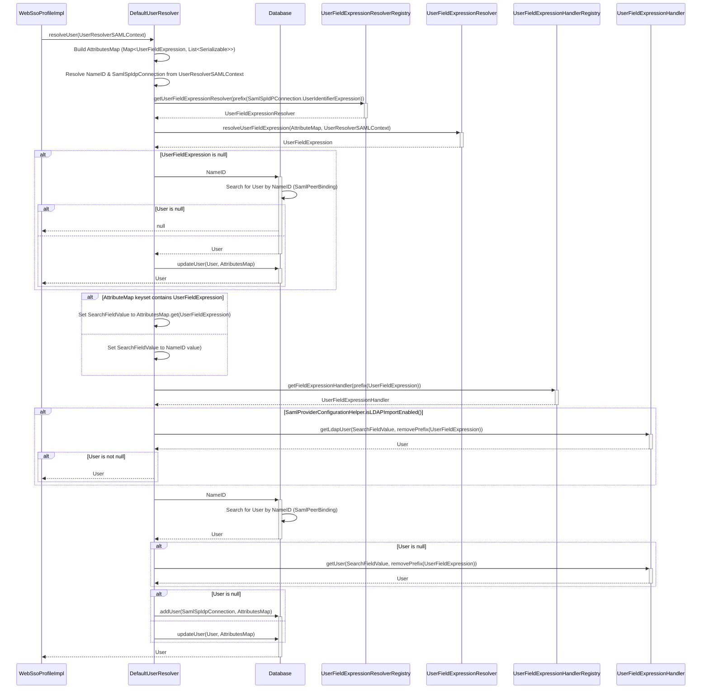

## DefaultUserResolver  
### Sequence Diagram

```mermaid
sequenceDiagram
    participant WebSsoProfileImpl
    participant DefaultUserResolver
    participant Database
    participant UserFieldExpressionResolverRegistry
    participant UserFieldExpressionResolver
    participant UserFieldExpressionHandlerRegistry
    participant UserFieldExpressionHandler
WebSsoProfileImpl->>DefaultUserResolver: resolveUser(UserResolverSAMLContext)
DefaultUserResolver->>DefaultUserResolver: Build AttributesMap (Map<UserFieldExpression, List<Serializable>>)
DefaultUserResolver->>DefaultUserResolver: Resolve NameID & SamlSpIdpConnection from UserResolverSAMLContext
DefaultUserResolver->>+UserFieldExpressionResolverRegistry: getUserFieldExpressionResolver(prefix(SamlSpIdPConnection.UserIdentifierExpression))
UserFieldExpressionResolverRegistry-->>-DefaultUserResolver: UserFieldExpressionResolver

DefaultUserResolver->>+UserFieldExpressionResolver: resolveUserFieldExpression(AttributeMap, UserResolverSAMLContext)
UserFieldExpressionResolver-->>-DefaultUserResolver: UserFieldExpression

alt UserFieldExpression is null
  DefaultUserResolver->>+Database: NameID
  Database->>Database: Search for User by NameID (SamlPeerBinding)
  alt User is null
    Database-->>WebSsoProfileImpl: null
  else
    Database-->>-DefaultUserResolver: User
    DefaultUserResolver->>+Database: updateUser(User, AttributesMap)
    Database-->>-WebSsoProfileImpl: User
  end
end

alt AttributeMap keyset contains UserFieldExpression
  DefaultUserResolver->>DefaultUserResolver: Set SearchFieldValue to AttributesMap.get(UserFieldExpression)
else
  DefaultUserResolver->>DefaultUserResolver: Set SearchFieldValue to NameID value)
end
DefaultUserResolver->>+UserFieldExpressionHandlerRegistry: getFieldExpressionHandler(prefix(UserFieldExpression))
UserFieldExpressionHandlerRegistry-->>-DefaultUserResolver: UserFieldExpressionHandler
alt SamlProviderConfigurationHelper.isLDAPImportEnabled()
  DefaultUserResolver->>+UserFieldExpressionHandler: getLdapUser(SearchFieldValue, removePrefix(UserFieldExpression))
  UserFieldExpressionHandler-->>-DefaultUserResolver: User
  alt User is not null
    DefaultUserResolver-->>WebSsoProfileImpl: User
  end
end

DefaultUserResolver->>+Database: NameID
Database->>Database: Search for User by NameID (SamlPeerBinding)
Database-->>-DefaultUserResolver: User

alt User is null
  DefaultUserResolver->>+UserFieldExpressionHandler: getUser(SearchFieldValue, removePrefix(UserFieldExpression))
  UserFieldExpressionHandler-->>-DefaultUserResolver: User
end

alt User is null
  DefaultUserResolver->>+Database: addUser(SamlSpIdpConnection, AttributesMap)
else
  DefaultUserResolver->>Database: updateUser(User, AttributesMap)
end
Database-->>-WebSsoProfileImpl: User
```
